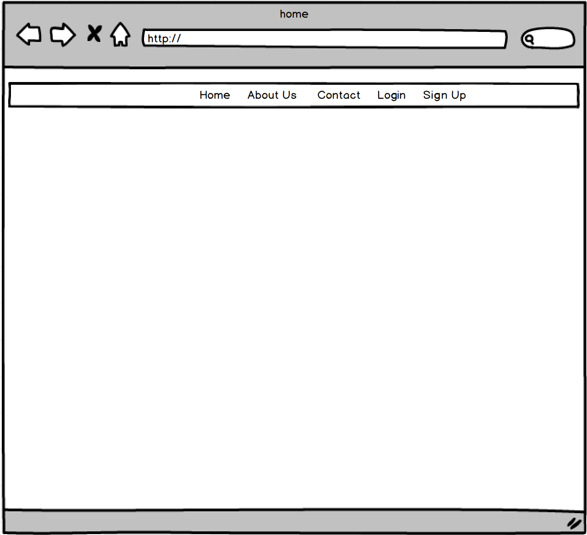
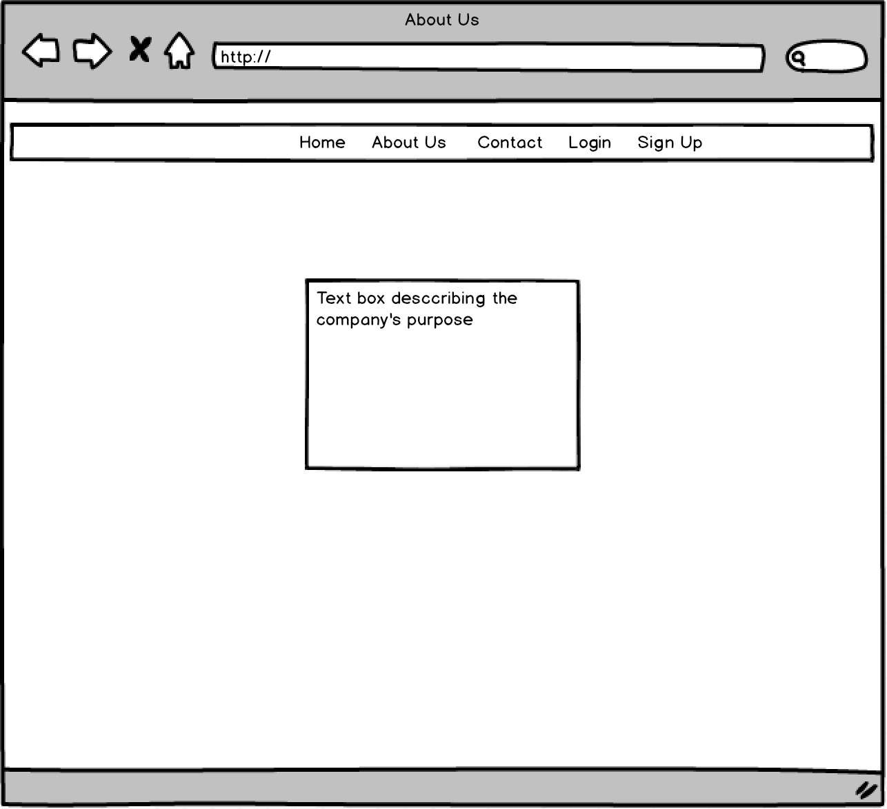
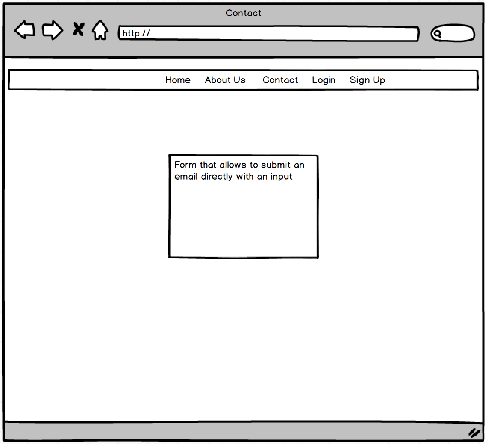
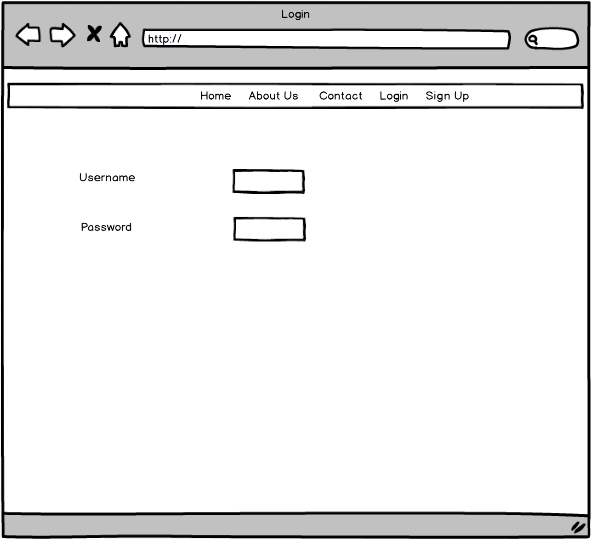
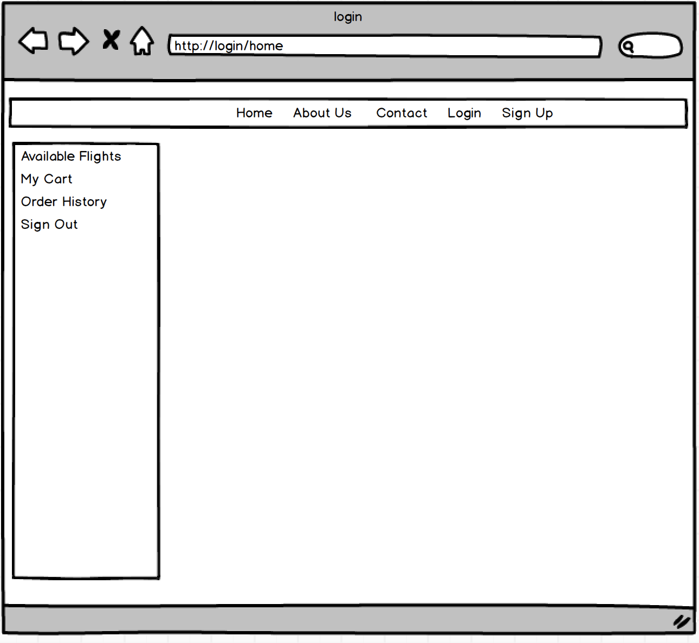
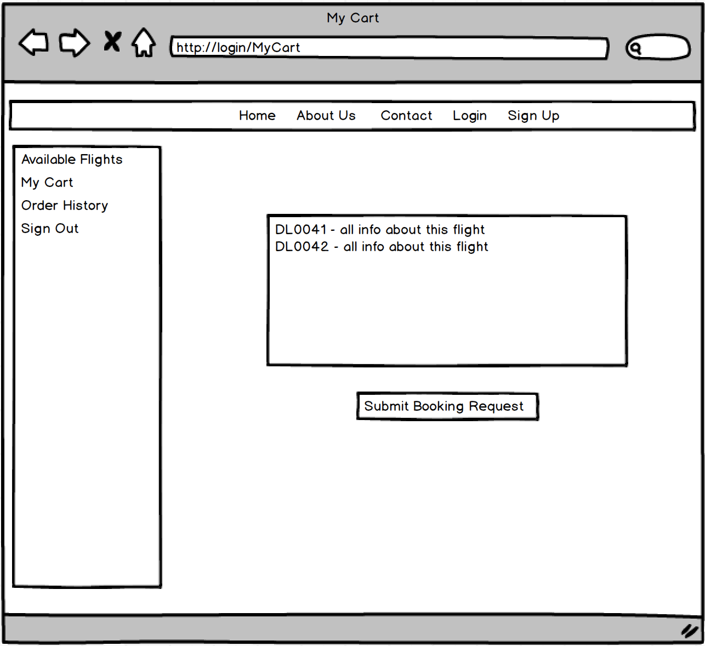
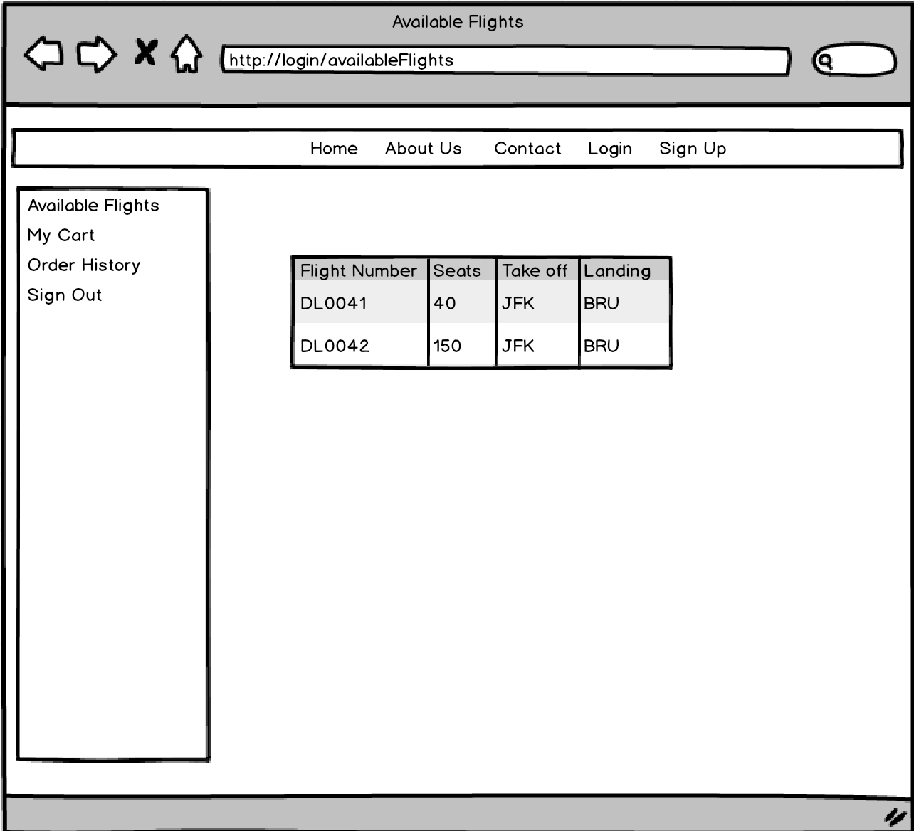
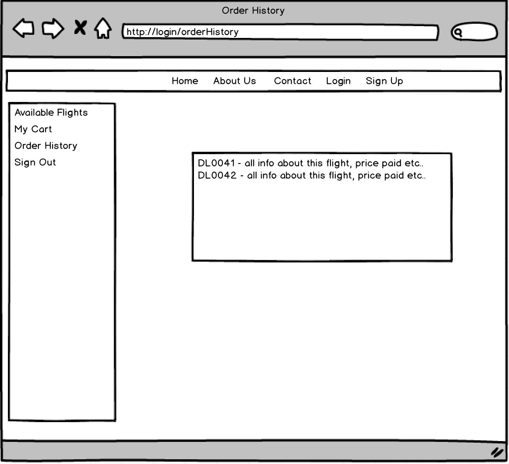
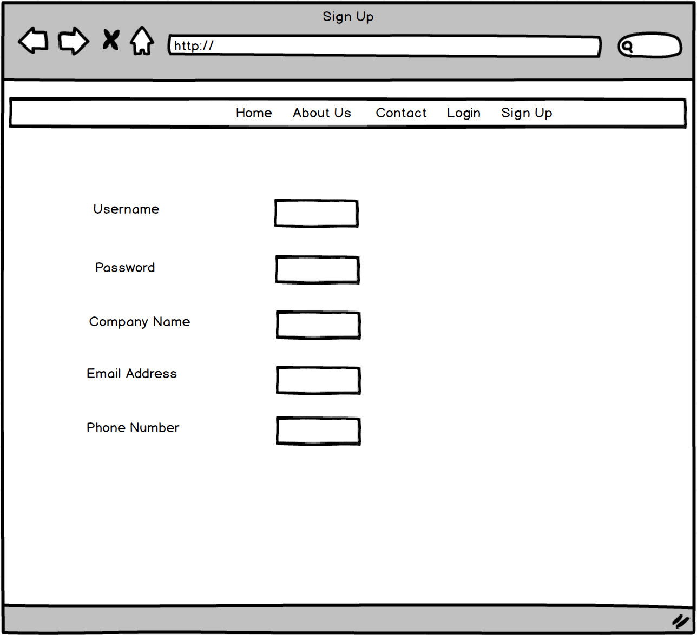
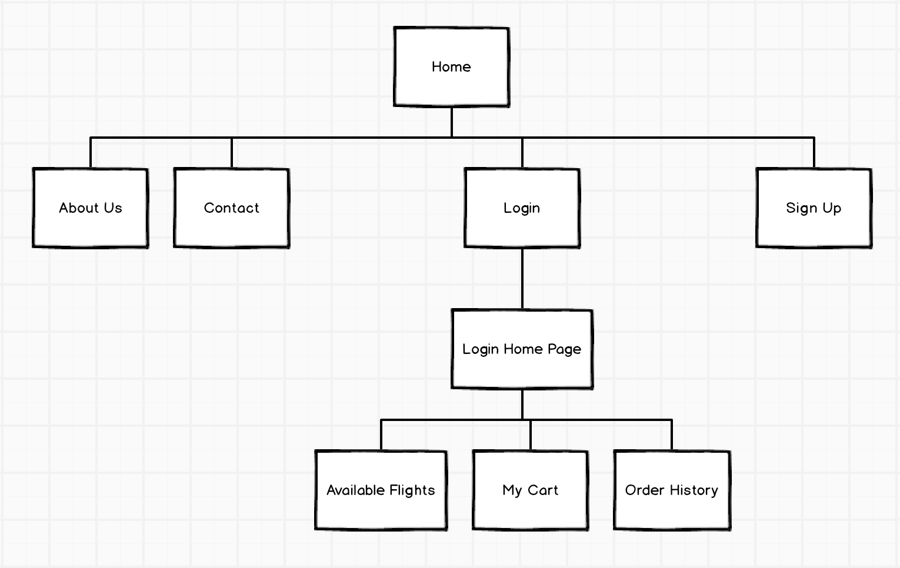

The content below is an example project proposal / requirements document. Replace the text below the lines marked "__TODO__" with details specific to your project. Remove the "TODO" lines.

# Ciel Travel Flight Booker

## Overview


When travel agencies have big groups of people traveling at the same time it is often
easier for them to book a whole flight or part of a flight at once rather than buying
tickets individually. That's where Ciel Travel Flight Booker comes in.

Ciel Travel Flight Booker is a web app that allows users to view a list of available flights
that are provided by a third party company: Ciel Travel. Users, which are travel agencies
can register and login. Once they're logged in, they can view a list of currently available
flights, with a detailed description of their take off and destination locations, dates, times
and number of available spots. They can keep track of flights they've already booked in or submit
a booking request for a new flight.

## Data Model

The application will store Users, Lists and Items

* users can have multiple lists (via references)
* each list can have multiple items (by embedding)

An Example User:

```javascript
{
  username: "XTravelAgency",
  hash: // a password hash,
  company: "companyX"
  email: "user@companyX.com"
  orderHistory: // an array of references to List documents which represent all bookings
  cart: //an array of references that represents the user's current cart
}
``

An Example List with Embedded Items:

```javascript
{
  user: // a reference to a User object
  name: "flights",
  items: [
    { flightNumber: "DL0042", availableSeats: "150", takeOffLocation:"JFK" takeOffDate:"03/30/2017", takeOffTime: "11:30", landingLocation:"BRU", landingDate:"03/31/2017", landingTime:"08:00"},
    { flightNumber: "DL0042", availableSeats: "50", takeOffLocation:"JFK" takeOffDate:"04/01/2017", takeOffTime: "11:30", landingLocation:"BRU", landingDate:"04/02/2017", landingTime:"08:00"},
  ],
  createdAt: // timestamp
}
```

## [Link to Commented First Draft Schema](db.js)


## Wireframes

/home - main page that shows up when the website is first reached



/aboutUs - page showing information about the company



/contact - page for contact information about the company



/login - page to login and sign up to the page



/login/home - page that loads after logging in, new side bar appears for user



/login/myCart- page to view the current cart for the current user



/login/availableFlights- page to view a list of available flights



/login/orderHistory- page to view the order history of the current user



/login/signUp- page to sign up as a new user



## Site map

Here is a [complex example from wikipedia](https://upload.wikimedia.org/wikipedia/commons/2/20/Sitemap_google.jpg), but you can create one without the screenshots, drop shadows, etc. ... just names of pages and where they flow to.


## User Stories or Use Cases

1. as non-registered user, I can register a new account with the site
2. as non-registered user, I can view information about the company
3. as non-registered user, I can contact the company
4. as a user, I can log in to the site
5. as a user, I can view a list of available flights
6. as a user, I can add a flight to my cart
7. as a user, I can check out by submitting my contact information and proposal for a flight booking
8. as a user, I view a history of flights I have previously booked

## Research Topics

* (5 points) Integrate user authentication
    * I am going to be using passport for user authentication
    * And account has been made for testing; I will email you the password
    * see <code>cs.nyu.edu/~jversoza/ait-final/register</code> for register page
    * see <code>cs.nyu.edu/~jversoza/ait-final/login</code> for login page
* (4 points) Perform client side form validation using a JavaScript library
    * see <code>cs.nyu.edu/~jversoza/ait-final/my-form</code>
    * if you put in a number that is greater than 5, an error message will appear in the dom
* (2 points) Use a CSS framework throughout your site, use a reasonable of customization of the framework (do not just use stock Bootstrap - minimally configure a theme):
  Bootstrap

11 points total out of 8 required points (___TODO__: addtional points will __not__ count for extra credit_)


## [Link to Initial Main Project File](app.js)


## Annotations / References Used

Used for bootstrap: https://www.w3schools.com/bootstrap/
Used for passport:
-https://www.youtube.com/watch?v=Z1ktxiqyiLA
-http://passportjs.org/
-https://github.com/ctavan/express-validator
